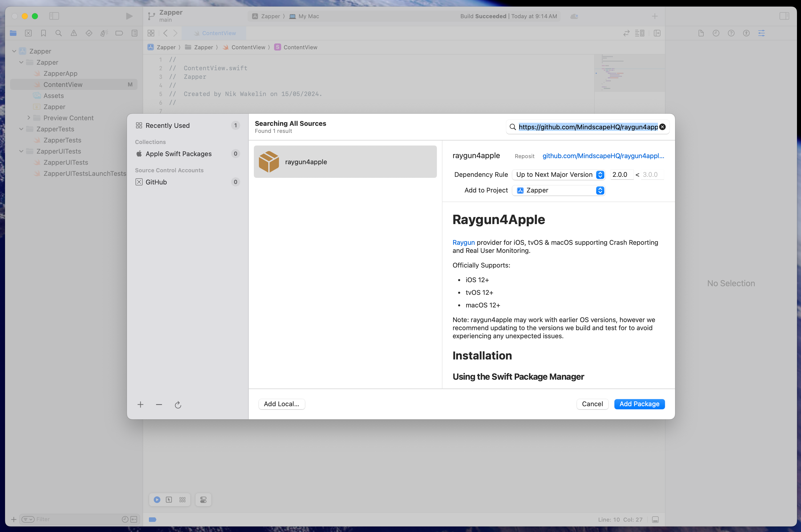
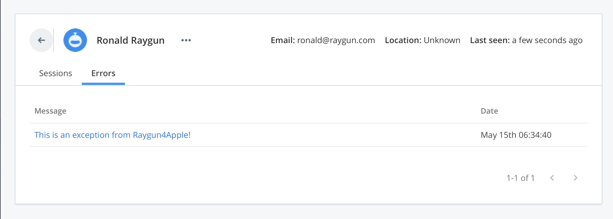

# Raygun4Apple

[Raygun](https://raygun.com/) provider for iOS, tvOS & macOS supporting Crash Reporting and Real User Monitoring.

Officially Supports:

- iOS 12+
- tvOS 12+
- macOS 12+

Note: raygun4apple may work with earlier OS versions, however we recommend updating to the versions we build and test for to avoid experiencing any unexpected issues.

## Installation

### Using the Swift Package Manager

#### From Xcode

1. Choose `File > Add Package Dependencies…`
2. In the Search field on the top right, enter the Github URL for raygun4apple: `https://github.com/MindscapeHQ/raygun4apple.git`
3. Click "Add Package", then choose your project under the "Add to Target" section. Click "Add Package" again.



You're now ready to [configure the client](#using-raygun).

#### OR: Manually

If you're not using Xcode to manage your packages, you can instead update your Package.swift file to include raygun4apple as a dependency.

Here is an example of a macOS CLI application which uses raygun4apple as a dependency:

```swift
import PackageDescription

let package = Package(
    name: "macos-cli",
    dependencies: [
        //Note - the version must be atleast 2.0.0 as this is earliest release of this package through SPM.
        .package(url: "https://github.com/MindscapeHQ/raygun4apple.git", from: "2.0.0"),
    ],
    targets: [
        .executableTarget(
            name: "macos-cli",
            dependencies: ["raygun4apple"])
    ]
)
```

### With CocoaPods

To integrate Raygun using CocoaPods, update your Podfile to include:

```bash
pod 'raygun4apple'
```

Once updated, you can run `pod install` from Terminal.

### With GitHub releases

The latest release can be found [here](https://github.com/MindscapeHQ/raygun4apple/releases). The frameworks are attached to each release as a zipped file. This can be downloaded, unzipped and included in you project directory.

Once included, go to your app's target **General** settings and add the raygun4apple framework to the **Frameworks, Libraries, and Embedded Content** section. Ensure that the framework is set to **Embed & Sign**.

## Using Raygun

### Swift

To use Raygun, import the package in your Swift file. Here is an example which imports raygun4apple, initializes the provider, and sends a test exception. Be sure to replace `YOUR_API_KEY_HERE` with your API key from your Application Settings screen in Raygun.

```swift
import raygun4apple

let raygunClient = RaygunClient.sharedInstance(apiKey: "YOUR_API_KEY_HERE")
raygunClient.enableCrashReporting()
raygunClient.send(exception: NSException.init(name: .genericException, reason: "This is an exception from Raygun4Apple!"))
```

NB: If you recieve a `A server with the specified hostname could not be found` error, you may need to [enable outbound connections for your app](https://developer.apple.com/documentation/bundleresources/entitlements/com_apple_security_network_client). Choose your project target in the left-hand navigator, then choose the "Signing & Capabilities" tab, and check the `Outgoing Connections (Client)` in the "App Sandbox" section.

#### Swift UI

_You might like to check our our [Swift UI example app](https://github.com/MindscapeHQ/Raygun4SwiftUI-ExampleApp)_

You likely want to start Raygun in your `AppDelegate`. By default newer Swift UI apps do not come with an `AppDelegate`, so you can [follow these instructions](https://www.hackingwithswift.com/quick-start/swiftui/how-to-add-an-appdelegate-to-a-swiftui-app) to add one to your project (for macOS you need to [use NSApplication](https://stackoverflow.com/questions/71291654/swiftui-appdelegate-on-macos) instead)

Once you've done that, your `AppDelegate.swift` should look something like this:

```swift
import Foundation
import UIKit
import raygun4apple


class AppDelegate: NSObject, UIApplicationDelegate {
    func application(_ application: UIApplication, didFinishLaunchingWithOptions launchOptions: [UIApplication.LaunchOptionsKey : Any]? = nil) -> Bool {

      let raygunClient = RaygunClient.sharedInstance(apiKey: "YOUR_API_KEY_HERE")
      raygunClient.enableCrashReporting()

      return true
    }
}
```

You are now tracking crashes across your application, and can report manually using the `RaygunClient.sharedInstance()`, for example:

```swift
RaygunClient.sharedInstance().send(exception: NSException.init(name: .genericException, reason: "This is an exception from Raygun4Apple!"))
```

#### Identifying customers

By default, each user will be identified as an anonymous user/customers. However you can set more detailed customer information with the following snippet.

```swift
RaygunClient.sharedInstance().userInformation = RaygunUserInformation.init(
    identifier: "123",
    email:      "ronald@raygun.com",
    fullName:   "Ronald Raygun",
    firstName:  "Ronald",
    anonymous:  false,
    uuid:       UUID().uuidString
)
```

(More initializers are provided on `RaygunUserInformation` should you want to omit some parts of this information)

Now your crashes will be tracked as affecting this user in Raygun Crash Reporting:



### Objective-C

In your AppDelegate class file, import the header for your target platform.

```objective-c
#import <raygun4apple/raygun4apple_iOS.h>
```

Initialize the Raygun client by adding the following snippet to your AppDelegate application:didFinishLaunchingWithOptions method:

```objective-c
[RaygunClient sharedInstanceWithApiKey:@"_INSERT_API_KEY_"];
[RaygunClient.sharedInstance enableCrashReporting];
[RaygunClient.sharedInstance enableRealUserMonitoring];
[RaygunClient.sharedInstance enableNetworkPerformanceMonitoring]; // Optional
```

## Sending a test error event

To ensure that the Raygun client is correctly configured, try sending a test crash report with the following snippet.

```objective-c
[RaygunClient.sharedInstance sendException:@"Raygun has been successfully integrated!"
                                withReason:@"A test crash report from Raygun"
                                  withTags:@[@"Test"]
                            withCustomData:@{@"TestMessage":@"Hello World!"}];
```

## Set up Customers

By default, each user will be identified as an anonymous user/customers. However you can set more detailed customer information with the following snippet.

```objective-c
RaygunUserInformation *userInfo = nil;
userInfo = [[RaygunUserInformation alloc] initWithIdentifier:@"ronald@raygun.com"
                                                   withEmail:@"ronald@raygun.com"
                                                withFullName:@"Ronald Raygun"
                                               withFirstName:@"Ronald"];
RaygunClient.sharedInstance.userInformation = userInfo;
```

## Custom Error Grouping

You can provide your own grouping key if you wish. We only recommend this if you're having issues with errors not being grouped properly by Raygun's default logic.

The `groupingKeyProvider` is a block (or closure in Swift) that you set on the `RaygunClient.sharedInstance`. This block is called when an error report is being prepared and it receives a `RaygunMessageDetails` object. This object contains all available information about the error, including the error message, class name, tags, custom data, user information, and the detailed thread (stack trace) information.

Your block should return an `NSString` (or `String` in Swift) that will be used as the grouping key. If you return `nil` or an empty string, Raygun will revert to its default grouping logic for that error.

**Important Note on Stack Traces:**
Inside the `RaygunMessageDetails` object:

- `details.error.stackTrace` (a simple array of strings) might be `nil`, especially for reports originating from crashes (KSCrash).
- `details.threads` (an array of `RaygunThread` objects, each containing `RaygunFrame` objects) provides the rich, structured stack trace information for all reports, including crashes. If your custom grouping logic needs to inspect stack frames, you should use `details.threads`.

### Objective-C Example

```objective-c
#import <raygun4apple/raygun4apple.h> // Or your specific platform import

// In your AppDelegate or relevant setup code:
RaygunClient.sharedInstance.groupingKeyProvider = ^NSString * _Nullable(RaygunMessageDetails * _Nonnull details) {
    // Example: Group by the error's class name and the first line of the error message.
    NSString *className = details.error.className ?: @"UnknownClass";
    NSString *messageSummary = @"NoMessage";

    if (details.error.message != nil && details.error.message.length > 0) {
        NSArray<NSString *> *lines = [details.error.message componentsSeparatedByString:@"\n"];
        if (lines.count > 0) {
            messageSummary = lines[0];
        }
    }

    // You could also inspect details.threads for stack trace information if needed.
    // For example, to get the class and method of the top-most application frame.

    return [NSString stringWithFormat:@"%@|%@", className, messageSummary];
};
```

### Swift Example

```swift
import raygun4apple

// In your AppDelegate or relevant setup code:
RaygunClient.sharedInstance().groupingKeyProvider = { details in
    // Example: Group by the error's class name and the first line of the error message.
    let className = details.error?.className ?? "UnknownClass"
    var messageSummary = "NoMessage"

    if let errorMessage = details.error?.message, !errorMessage.isEmpty {
        messageSummary = errorMessage.components(separatedBy: "\n").first ?? ""
    }

    // You could also inspect details.threads for stack trace information if needed.
    // For example, to get the class and method of the top-most application frame.

    return "\(className)|\(messageSummary)"
}
```

This allows you to customize how errors are grouped together in the Raygun dashboard based on any data present in the `RaygunMessageDetails`.

## Documentation

For more information please visit our public documentation [here](https://raygun.com/documentation/language-guides/apple/).
